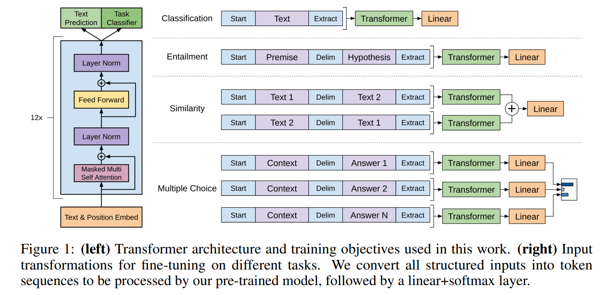

<!-- ---
title: "GPT3"
--- -->
# GPT3

Paper: [Improving Language Understanding by Generative Pre-Training](https://cdn.openai.com/research-covers/language-unsupervised/language_understanding_paper.pdf)

## 1. Introduction
Task: generative pre-training -> disscriminative fine-tuning
Why Transformer not RNN? -> Transformer is more parallelizable and can learn long-range dependencies (strcutured memory).
## 2. Method
### 2.1 Pre-training
Given a unsupervised corpus of tokens $\mathcal{U}=\{u_1, u_2, ..., u_n\}$, the goal is to learn a model $P(u_i|u_1, u_2, ..., u_{i-1})$ that assigns a probability to each token in the corpus. The model is trained by maximizing the log-likelihood of the corpus:

$$L_1(\mathcal{U})=\sum_{i=1}^n \log P(u_i|u_1, u_2, ..., u_{i-1}; \Theta)$$

Archetecture: Transformer decoder
Why? We only look at the words before the current word. The decoder is auto-regressive, so it can be used to generate text. The decoder is also masked, so it can be used to predict the next word in a sequence.

 Given $U=(u_{-k}, ..., u_{-1})$, which is the context vector of  tokens:

$$h_0 = UW_e + W_p \\
h_i = TransformerBlock(h_{i-1}) \forall i \in [1,n] \\
P(u_i|U) = softmax(h_nW_e^T)$$

where $W_e$ is the token embedding matrix, $W_p$ is the position embedding matrix, and $TransformerBlock$ is a standard Transformer decoder block.

Different from BERT: BERT uses a bidirectional Transformer encoder, while GPT uses a left-to-right Transformer decoder. GPT is auto-regressive, so it can be used to generate text. BERT is bidirectional, so it can be used to predict masked tokens.

### 2.2 Fine-tuning
Assume a labled dataset $\mathcal{C}$, where each instance consists of a sequence of input tokens, $x=(x_1, x_2, ..., x_m)$, and a sequence of output tokens, $y=(y_1, y_2, ..., y_n)$. The inputs are passed through our pre-trained mdoel to obtain the ***final*** transformer block output, $h_m$. The output tokens are then predicted by a linear transformation of $h_m$:
$$P(y|x_1, x_2, ..., x_m) = softmax(h_mW_y^T)$$

where $W_y$ is a learned matrix.

The objective is to maximize the log-likelihood of the labeled dataset:
$$L_2(\mathcal{C})=\sum_{(x,y)\in \mathcal{C}} \log P(y|x_1, x_2, ..., x_m)$$

Including the pre-training objective as an auxiliary loss can help improve the generalization of the model and facilitate convergence:
$$L_3(\mathcal{C})=L_2(\mathcal{C})+\lambda L_1(\mathcal{C})$$

where $\lambda$ is a hyperparameter that controls the relative importance of the two losses.

### 2.3 Task-specific input transformations
<!--  -->

The key idea in this framework is the parameters of pre-trained Transformer blocks are shared across all tasks and will never be changed. The only task-specific parameters are the input and output embeddings and the final linear transformation. 

## 3. Experiments
Data: BooksCorpus

