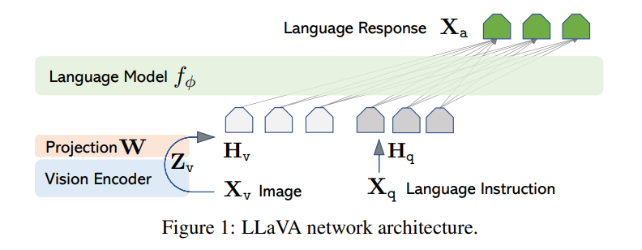

# LLAVA

Paper: [Visual Intruction Tuning](https://arxiv.org/abs/2304.08485) \
Github: https://github.com/haotian-liu/LLaVA

## 1. Data
Pretraining: https://huggingface.co/datasets/liuhaotian/LLaVA-CC3M-Pretrain-595K \
Fine Tuning: https://huggingface.co/datasets/liuhaotian/LLaVA-Instruct-150K

## 2. Model structure

LLM $f_{\phi}$: vicuna \
Vision Encoder: "ViT-L/14" 

$$\mathbf{H}_v
